# MarketFlow AI Architecture

MarketFlow AI is an autonomous marketing platform for Shopify and WooCommerce stores. It observes commerce data, plans campaigns, generates creative, requests human approval for risky actions, and executes approved changes through ad platforms.

## Product Principles

- The system should recommend autonomously but execute cautiously.
- Every AI recommendation must be traceable to input data, model output, confidence, and approval state.
- Budget changes, campaign launches, and destructive ad actions require human approval unless a user has created an explicit automation policy.
- Agents should be modular services with typed inputs and outputs, not hidden prompt chains.
- Integrations should be isolated behind adapter interfaces so Shopify, WooCommerce, Meta Ads, Google Ads, email, and future channels can evolve independently.

## Scalable System Architecture

### High-Level Components

```mermaid
flowchart LR
    Storefronts["Shopify / WooCommerce"] --> Ingestion["Integration Workers"]
    Ads["Meta Ads / Google Ads"] --> Metrics["Ads Metrics Workers"]
    Ingestion --> Queue["Event Queue"]
    Metrics --> Queue
    Queue --> Observer["Data Observer Agent"]
    Observer --> Warehouse["PostgreSQL + Analytics Tables"]
    Warehouse --> Strategist["AI Strategist Agent"]
    Strategist --> Decisions["AI Decisions + Action Proposals"]
    Decisions --> Approval["Human Approval Workflow"]
    Approval --> Executor["Execution & Optimization Agent"]
    Executor --> Ads
    Decisions --> Creative["Creative Engine"]
    Creative --> Assets["Supabase Storage"]
    Assets --> Approval
    API["FastAPI Backend"] --> Warehouse
    API --> Approval
    Web["SaaS Dashboard"] --> API
```



### Recommended Runtime Architecture

- `FastAPI API`: Serves dashboard data, onboarding, approvals, campaign control, webhooks, and integration OAuth callbacks.
- `PostgreSQL on Supabase`: Source of truth for tenants, stores, products, customers, campaigns, AI decisions, approval requests, execution logs, and audit trails.
- `Supabase Auth`: Handles user identity, sessions, row-level security, and organization membership.
- `Supabase Storage`: Stores product images, generated ad banners, creative exports, approval snapshots, and report PDFs.
- `Redis`: Caches recent metrics, rate-limit state, OAuth token locks, job deduplication keys, and short-lived workflow state.
- `Celery or Dramatiq workers`: Run ingestion syncs, daily analysis, creative generation, ad publishing, optimization loops, and webhook retries.
- `Event queue`: Redis Streams is enough for MVP; upgrade to Kafka, RabbitMQ, or AWS SQS/SNS once event volume or replay needs grow.
- `LangGraph over LangChain`: Prefer LangGraph for deterministic multi-agent orchestration, approval gates, retries, and durable state. CrewAI is useful for prototypes, but LangGraph is better when you need production control.
- `Observability`: OpenTelemetry, structured JSON logs, Sentry, Prometheus/Grafana, and per-agent trace IDs.

### Agent Responsibilities

#### Data Observer Agent

Inputs:

- Store orders, product catalog, inventory, refunds, discounts, customer events, traffic sources, and ad performance.

Responsibilities:

- Sync Shopify/WooCommerce data on a schedule and by webhook.
- Normalize products, variants, orders, customers, and events into canonical tables.
- Calculate product performance metrics: revenue, units sold, gross margin, conversion rate, return rate, inventory velocity, stockout risk, and ad-attributed ROAS.
- Classify products as `winning`, `stable`, `underperforming`, `new`, or `at_risk`.
- Emit observations for the strategist agent.

Output:

- `product_insights`, `store_metric_snapshots`, and structured observations attached to an `agent_run`.

#### AI Strategist Agent

Inputs:

- Product insights, ad account metrics, current campaign state, business goals, store constraints, inventory availability, budget policy, and historical ROI.

Responsibilities:

- Recommend campaign actions: launch, pause, scale, discount, retarget, test creative, shift budget, or hold.
- Calculate budget changes using configured guardrails.
- Explain the reasoning in plain language with supporting data.
- Assign confidence, expected impact, risk level, and required approval type.

Output:

- `ai_decisions` and `action_proposals`.

#### Creative Engine

Inputs:

- Product details, brand voice, target audience, previous winning ads, channel constraints, and product imagery.

Responsibilities:

- Generate ad copy variants: primary text, headline, description, CTA, captions, and hooks.
- Generate or request image assets using DALL-E, Flux, or another provider through a provider adapter.
- Score creative variants for policy risk, brand fit, and channel compatibility.
- Store generated assets and metadata.

Output:

- `creative_assets` and `creative_variants`.

#### Execution & Optimization Agent

Inputs:

- Approved action proposals, channel credentials, campaign mappings, performance metrics, and automation policies.

Responsibilities:

- Publish campaigns to Meta Ads and Google Ads.
- Pause low-performing ads based on policy thresholds.
- Scale winning campaigns within daily and lifetime budget limits.
- Request approval before launches, budget increases, audience expansion, or discount changes.
- Write every external API request and resulting platform object ID to execution logs.

Output:

- `campaigns`, `ad_sets`, `ads`, `execution_logs`, and updated proposal status.

### Core Workflows

#### Store Onboarding

1. User creates an organization and connects a Shopify or WooCommerce store.
2. Backend stores encrypted OAuth/API credentials.
3. Initial catalog, order, customer, and inventory sync starts.
4. Observer calculates baseline product metrics.
5. Dashboard shows readiness score and missing setup items.

#### Daily Autonomous Planning

1. Scheduler creates an `agent_run` for each active store.
2. Observer updates product and campaign metrics.
3. Strategist generates ranked decisions.
4. Creative Engine prepares campaign-ready copy and images for launch proposals.
5. System creates approval requests for actions above risk thresholds.
6. User approves, rejects, or requests edits.
7. Executor applies approved actions and logs platform responses.

#### Optimization Loop

1. Ads metrics workers sync performance several times per day.
2. Optimization Agent evaluates active campaigns against guardrails.
3. Safe actions like tagging or low-risk pausing may run automatically if policy allows.
4. Budget increases, launches, and major targeting changes require approval.
5. Results feed back into strategist memory and product insights.

### Approval And Safety Model

- `approval_required`: New campaign launch, budget increase, discount creation, audience expansion, creative publication, product claim change, or policy-sensitive content.
- `auto_allowed`: Reporting, draft creative generation, metric sync, anomaly detection, low-risk recommendations, and pausing spend after severe threshold breach if configured.
- `blocked`: Any action that violates channel policy, exceeds account budget, lacks attribution data, targets sensitive categories incorrectly, or uses expired credentials.

### Multi-Tenant Security

- Use Supabase Auth user IDs in `users.auth_user_id`.
- Scope every business object by `organization_id`.
- Enable PostgreSQL row-level security for tenant-owned tables.
- Encrypt external platform credentials with KMS or Supabase Vault.
- Never expose raw access tokens to frontend clients.
- Store all AI prompts, outputs, approvals, and executions for auditability.

## PostgreSQL Schema

The schema below is optimized for a production MVP. It keeps tenant data isolated, records AI reasoning, and supports human-in-the-loop campaign execution.

```sql
create extension if not exists "uuid-ossp";
create extension if not exists pgcrypto;

create type user_role as enum ('owner', 'admin', 'marketer', 'viewer');
create type store_platform as enum ('shopify', 'woocommerce');
create type store_status as enum ('connecting', 'active', 'needs_attention', 'disabled');
create type product_status as enum ('active', 'draft', 'archived');
create type product_performance_label as enum ('winning', 'stable', 'underperforming', 'new', 'at_risk');
create type ad_platform as enum ('meta', 'google', 'tiktok', 'email');
create type campaign_status as enum ('draft', 'pending_approval', 'scheduled', 'active', 'paused', 'completed', 'failed');
create type decision_status as enum ('draft', 'pending_approval', 'approved', 'rejected', 'executed', 'failed', 'expired');
create type approval_status as enum ('pending', 'approved', 'rejected', 'expired', 'cancelled');
create type action_type as enum ('launch_campaign', 'pause_campaign', 'scale_budget', 'reduce_budget', 'create_discount', 'generate_creative', 'update_targeting');
create type risk_level as enum ('low', 'medium', 'high', 'critical');
create type agent_type as enum ('observer', 'strategist', 'creative', 'execution_optimizer');

create table organizations (
    id uuid primary key default gen_random_uuid(),
    name text not null,
    billing_email text,
    default_currency char(3) not null default 'USD',
    timezone text not null default 'UTC',
    plan_key text not null default 'starter',
    created_at timestamptz not null default now(),
    updated_at timestamptz not null default now()
);

create table users (
    id uuid primary key default gen_random_uuid(),
    auth_user_id uuid not null unique,
    email citext not null unique,
    full_name text,
    avatar_url text,
    created_at timestamptz not null default now(),
    updated_at timestamptz not null default now()
);

create table organization_members (
    organization_id uuid not null references organizations(id) on delete cascade,
    user_id uuid not null references users(id) on delete cascade,
    role user_role not null default 'viewer',
    created_at timestamptz not null default now(),
    primary key (organization_id, user_id)
);

create table stores (
    id uuid primary key default gen_random_uuid(),
    organization_id uuid not null references organizations(id) on delete cascade,
    platform store_platform not null,
    status store_status not null default 'connecting',
    name text not null,
    domain text not null,
    external_store_id text,
    currency char(3) not null default 'USD',
    timezone text not null default 'UTC',
    access_token_encrypted text,
    refresh_token_encrypted text,
    token_expires_at timestamptz,
    last_synced_at timestamptz,
    created_at timestamptz not null default now(),
    updated_at timestamptz not null default now(),
    unique (organization_id, platform, domain)
);

create table customers (
    id uuid primary key default gen_random_uuid(),
    store_id uuid not null references stores(id) on delete cascade,
    external_customer_id text,
    email_hash text,
    first_seen_at timestamptz,
    last_seen_at timestamptz,
    total_spend numeric(14,2) not null default 0,
    order_count integer not null default 0,
    metadata jsonb not null default '{}',
    created_at timestamptz not null default now(),
    updated_at timestamptz not null default now(),
    unique (store_id, external_customer_id)
);

create table products (
    id uuid primary key default gen_random_uuid(),
    store_id uuid not null references stores(id) on delete cascade,
    external_product_id text not null,
    title text not null,
    handle text,
    description text,
    product_type text,
    vendor text,
    status product_status not null default 'active',
    image_url text,
    price numeric(14,2),
    cost numeric(14,2),
    inventory_quantity integer,
    metadata jsonb not null default '{}',
    created_at timestamptz not null default now(),
    updated_at timestamptz not null default now(),
    unique (store_id, external_product_id)
);

create table product_variants (
    id uuid primary key default gen_random_uuid(),
    product_id uuid not null references products(id) on delete cascade,
    external_variant_id text not null,
    sku text,
    title text,
    price numeric(14,2),
    cost numeric(14,2),
    inventory_quantity integer,
    metadata jsonb not null default '{}',
    created_at timestamptz not null default now(),
    updated_at timestamptz not null default now(),
    unique (product_id, external_variant_id)
);

create table orders (
    id uuid primary key default gen_random_uuid(),
    store_id uuid not null references stores(id) on delete cascade,
    customer_id uuid references customers(id) on delete set null,
    external_order_id text not null,
    order_number text,
    currency char(3) not null,
    subtotal_price numeric(14,2) not null default 0,
    total_price numeric(14,2) not null default 0,
    total_tax numeric(14,2) not null default 0,
    total_discount numeric(14,2) not null default 0,
    financial_status text,
    fulfillment_status text,
    ordered_at timestamptz not null,
    metadata jsonb not null default '{}',
    created_at timestamptz not null default now(),
    updated_at timestamptz not null default now(),
    unique (store_id, external_order_id)
);

create table order_items (
    id uuid primary key default gen_random_uuid(),
    order_id uuid not null references orders(id) on delete cascade,
    product_id uuid references products(id) on delete set null,
    product_variant_id uuid references product_variants(id) on delete set null,
    external_line_item_id text,
    quantity integer not null,
    unit_price numeric(14,2) not null,
    total_discount numeric(14,2) not null default 0,
    created_at timestamptz not null default now()
);

create table ad_accounts (
    id uuid primary key default gen_random_uuid(),
    organization_id uuid not null references organizations(id) on delete cascade,
    platform ad_platform not null,
    external_account_id text not null,
    name text not null,
    currency char(3) not null default 'USD',
    access_token_encrypted text,
    refresh_token_encrypted text,
    token_expires_at timestamptz,
    status text not null default 'active',
    created_at timestamptz not null default now(),
    updated_at timestamptz not null default now(),
    unique (organization_id, platform, external_account_id)
);

create table campaigns (
    id uuid primary key default gen_random_uuid(),
    organization_id uuid not null references organizations(id) on delete cascade,
    store_id uuid not null references stores(id) on delete cascade,
    ad_account_id uuid references ad_accounts(id) on delete set null,
    platform ad_platform not null,
    external_campaign_id text,
    name text not null,
    objective text not null,
    status campaign_status not null default 'draft',
    daily_budget numeric(14,2),
    lifetime_budget numeric(14,2),
    start_at timestamptz,
    end_at timestamptz,
    metadata jsonb not null default '{}',
    created_by_decision_id uuid,
    created_at timestamptz not null default now(),
    updated_at timestamptz not null default now()
);

create table ad_groups (
    id uuid primary key default gen_random_uuid(),
    campaign_id uuid not null references campaigns(id) on delete cascade,
    external_ad_group_id text,
    name text not null,
    targeting jsonb not null default '{}',
    daily_budget numeric(14,2),
    status campaign_status not null default 'draft',
    created_at timestamptz not null default now(),
    updated_at timestamptz not null default now()
);

create table creative_assets (
    id uuid primary key default gen_random_uuid(),
    organization_id uuid not null references organizations(id) on delete cascade,
    store_id uuid references stores(id) on delete cascade,
    product_id uuid references products(id) on delete set null,
    asset_type text not null,
    provider text,
    storage_path text,
    public_url text,
    prompt text,
    generation_metadata jsonb not null default '{}',
    created_at timestamptz not null default now()
);

create table ads (
    id uuid primary key default gen_random_uuid(),
    campaign_id uuid not null references campaigns(id) on delete cascade,
    ad_group_id uuid references ad_groups(id) on delete cascade,
    creative_asset_id uuid references creative_assets(id) on delete set null,
    external_ad_id text,
    name text not null,
    primary_text text,
    headline text,
    description text,
    call_to_action text,
    destination_url text,
    status campaign_status not null default 'draft',
    created_at timestamptz not null default now(),
    updated_at timestamptz not null default now()
);

create table store_metric_snapshots (
    id uuid primary key default gen_random_uuid(),
    store_id uuid not null references stores(id) on delete cascade,
    snapshot_date date not null,
    revenue numeric(14,2) not null default 0,
    orders_count integer not null default 0,
    conversion_rate numeric(8,4),
    average_order_value numeric(14,2),
    total_ad_spend numeric(14,2) not null default 0,
    blended_roas numeric(10,4),
    metadata jsonb not null default '{}',
    created_at timestamptz not null default now(),
    unique (store_id, snapshot_date)
);

create table product_insights (
    id uuid primary key default gen_random_uuid(),
    product_id uuid not null references products(id) on delete cascade,
    snapshot_date date not null,
    performance_label product_performance_label not null,
    units_sold integer not null default 0,
    revenue numeric(14,2) not null default 0,
    gross_margin numeric(14,2),
    inventory_velocity numeric(10,4),
    stockout_risk numeric(5,4),
    attributed_ad_spend numeric(14,2) not null default 0,
    attributed_roas numeric(10,4),
    confidence numeric(5,4) not null default 0,
    explanation text,
    created_at timestamptz not null default now(),
    unique (product_id, snapshot_date)
);

create table campaign_metrics (
    id uuid primary key default gen_random_uuid(),
    campaign_id uuid not null references campaigns(id) on delete cascade,
    metric_date date not null,
    impressions integer not null default 0,
    clicks integer not null default 0,
    spend numeric(14,2) not null default 0,
    conversions integer not null default 0,
    revenue numeric(14,2) not null default 0,
    roas numeric(10,4),
    ctr numeric(10,4),
    cpc numeric(14,4),
    cpa numeric(14,4),
    created_at timestamptz not null default now(),
    unique (campaign_id, metric_date)
);

create table agent_runs (
    id uuid primary key default gen_random_uuid(),
    organization_id uuid not null references organizations(id) on delete cascade,
    store_id uuid references stores(id) on delete cascade,
    agent agent_type not null,
    status text not null default 'running',
    input_ref jsonb not null default '{}',
    output_ref jsonb not null default '{}',
    error_message text,
    trace_id text,
    started_at timestamptz not null default now(),
    completed_at timestamptz
);

create table ai_decisions (
    id uuid primary key default gen_random_uuid(),
    organization_id uuid not null references organizations(id) on delete cascade,
    store_id uuid references stores(id) on delete cascade,
    agent_run_id uuid references agent_runs(id) on delete set null,
    status decision_status not null default 'draft',
    title text not null,
    summary text not null,
    action_type action_type not null,
    risk_level risk_level not null default 'medium',
    confidence numeric(5,4) not null default 0,
    expected_impact jsonb not null default '{}',
    reasoning jsonb not null default '{}',
    model_name text,
    prompt_version text,
    expires_at timestamptz,
    created_at timestamptz not null default now(),
    updated_at timestamptz not null default now()
);

create table action_proposals (
    id uuid primary key default gen_random_uuid(),
    ai_decision_id uuid not null references ai_decisions(id) on delete cascade,
    target_type text not null,
    target_id uuid,
    payload jsonb not null,
    requires_approval boolean not null default true,
    status decision_status not null default 'pending_approval',
    created_at timestamptz not null default now(),
    updated_at timestamptz not null default now()
);

create table approval_requests (
    id uuid primary key default gen_random_uuid(),
    organization_id uuid not null references organizations(id) on delete cascade,
    ai_decision_id uuid references ai_decisions(id) on delete cascade,
    action_proposal_id uuid references action_proposals(id) on delete cascade,
    requested_by_agent_run_id uuid references agent_runs(id) on delete set null,
    status approval_status not null default 'pending',
    requested_message text not null,
    approver_user_id uuid references users(id) on delete set null,
    approver_note text,
    decided_at timestamptz,
    expires_at timestamptz,
    created_at timestamptz not null default now()
);

create table execution_logs (
    id uuid primary key default gen_random_uuid(),
    organization_id uuid not null references organizations(id) on delete cascade,
    action_proposal_id uuid references action_proposals(id) on delete set null,
    platform ad_platform,
    operation text not null,
    request_payload jsonb not null default '{}',
    response_payload jsonb not null default '{}',
    external_object_id text,
    status text not null,
    error_message text,
    created_at timestamptz not null default now()
);

create table automation_policies (
    id uuid primary key default gen_random_uuid(),
    organization_id uuid not null references organizations(id) on delete cascade,
    store_id uuid references stores(id) on delete cascade,
    name text not null,
    is_enabled boolean not null default false,
    max_daily_budget_increase_pct numeric(6,4) not null default 0.1000,
    max_daily_budget_amount numeric(14,2),
    min_roas_to_scale numeric(10,4),
    max_cpa_to_keep_active numeric(14,4),
    allow_auto_pause boolean not null default true,
    allow_auto_scale boolean not null default false,
    rules jsonb not null default '{}',
    created_at timestamptz not null default now(),
    updated_at timestamptz not null default now()
);

create table audit_events (
    id uuid primary key default gen_random_uuid(),
    organization_id uuid references organizations(id) on delete cascade,
    user_id uuid references users(id) on delete set null,
    event_type text not null,
    entity_type text,
    entity_id uuid,
    metadata jsonb not null default '{}',
    created_at timestamptz not null default now()
);

create index idx_stores_org on stores(organization_id);
create index idx_products_store on products(store_id);
create index idx_orders_store_ordered_at on orders(store_id, ordered_at desc);
create index idx_campaigns_org_status on campaigns(organization_id, status);
create index idx_ai_decisions_org_status on ai_decisions(organization_id, status);
create index idx_approval_requests_org_status on approval_requests(organization_id, status);
create index idx_execution_logs_org_created_at on execution_logs(organization_id, created_at desc);
```

### Schema Notes

- `users` mirrors Supabase Auth users while `organization_members` supports multi-tenant teams.
- `stores` and `ad_accounts` keep encrypted credentials server-side only.
- `agent_runs` captures each agent execution and provides traceability across observations, decisions, approvals, and execution.
- `ai_decisions` stores the strategic recommendation; `action_proposals` stores the exact machine-executable action.
- `approval_requests` is the human-in-the-loop checkpoint.
- `execution_logs` is the audit trail for calls to Meta Ads, Google Ads, Shopify, and WooCommerce.
- `automation_policies` lets advanced users opt into safe autopilot behavior later without weakening the default safety model.

## Suggested Folder Structure

```text
marketflow-ai/
├── apps/
│   ├── api/
│   │   ├── app/
│   │   │   ├── main.py
│   │   │   ├── core/
│   │   │   │   ├── config.py
│   │   │   │   ├── security.py
│   │   │   │   ├── logging.py
│   │   │   │   └── database.py
│   │   │   ├── api/
│   │   │   │   ├── deps.py
│   │   │   │   └── v1/
│   │   │   │       ├── auth.py
│   │   │   │       ├── stores.py
│   │   │   │       ├── products.py
│   │   │   │       ├── campaigns.py
│   │   │   │       ├── approvals.py
│   │   │   │       ├── decisions.py
│   │   │   │       └── webhooks.py
│   │   │   ├── models/
│   │   │   │   ├── organization.py
│   │   │   │   ├── store.py
│   │   │   │   ├── product.py
│   │   │   │   ├── campaign.py
│   │   │   │   ├── decision.py
│   │   │   │   └── approval.py
│   │   │   ├── schemas/
│   │   │   │   ├── store.py
│   │   │   │   ├── campaign.py
│   │   │   │   ├── decision.py
│   │   │   │   └── approval.py
│   │   │   ├── services/
│   │   │   │   ├── approval_service.py
│   │   │   │   ├── campaign_service.py
│   │   │   │   ├── decision_service.py
│   │   │   │   └── metrics_service.py
│   │   │   ├── integrations/
│   │   │   │   ├── shopify/
│   │   │   │   │   ├── client.py
│   │   │   │   │   ├── mapper.py
│   │   │   │   │   └── webhooks.py
│   │   │   │   ├── woocommerce/
│   │   │   │   │   ├── client.py
│   │   │   │   │   └── mapper.py
│   │   │   │   ├── meta_ads/
│   │   │   │   │   ├── client.py
│   │   │   │   │   ├── publisher.py
│   │   │   │   │   └── metrics.py
│   │   │   │   └── google_ads/
│   │   │   │       ├── client.py
│   │   │   │       ├── publisher.py
│   │   │   │       └── metrics.py
│   │   │   ├── agents/
│   │   │   │   ├── graph.py
│   │   │   │   ├── state.py
│   │   │   │   ├── observer_agent.py
│   │   │   │   ├── strategist_agent.py
│   │   │   │   ├── creative_agent.py
│   │   │   │   ├── execution_agent.py
│   │   │   │   ├── prompts/
│   │   │   │   │   ├── strategist_v1.md
│   │   │   │   │   └── creative_v1.md
│   │   │   │   └── tools/
│   │   │   │       ├── metrics_tools.py
│   │   │   │       ├── budget_tools.py
│   │   │   │       └── creative_tools.py
│   │   │   ├── workers/
│   │   │   │   ├── celery_app.py
│   │   │   │   ├── ingestion_tasks.py
│   │   │   │   ├── agent_tasks.py
│   │   │   │   ├── creative_tasks.py
│   │   │   │   └── execution_tasks.py
│   │   │   └── tests/
│   │   │       ├── unit/
│   │   │       ├── integration/
│   │   │       └── contract/
│   │   ├── alembic/
│   │   │   ├── versions/
│   │   │   └── env.py
│   │   ├── pyproject.toml
│   │   └── Dockerfile
│   └── web/
│       ├── src/
│       │   ├── app/
│       │   │   ├── dashboard/
│       │   │   ├── campaigns/
│       │   │   ├── approvals/
│       │   │   ├── decisions/
│       │   │   └── settings/
│       │   ├── components/
│       │   ├── lib/
│       │   │   ├── api.ts
│       │   │   ├── supabase.ts
│       │   │   └── auth.ts
│       │   └── styles/
│       ├── package.json
│       └── Dockerfile
├── packages/
│   ├── shared-types/
│   └── prompt-registry/
├── infra/
│   ├── docker-compose.yml
│   ├── supabase/
│   │   ├── migrations/
│   │   ├── seed.sql
│   │   └── rls.sql
│   ├── terraform/
│   └── observability/
│       ├── prometheus.yml
│       └── grafana/
├── docs/
│   ├── architecture.md
│   ├── api.md
│   ├── agent-contracts.md
│   └── security.md
├── scripts/
│   ├── dev.ps1
│   ├── migrate.ps1
│   └── seed.ps1
├── .env.example
├── README.md
└── Makefile
```

## API Surface For MVP

- `POST /v1/stores/connect/shopify`: Start Shopify OAuth.
- `POST /v1/stores/connect/woocommerce`: Save WooCommerce credentials after validation.
- `GET /v1/stores/{store_id}/insights`: Return store and product performance insights.
- `POST /v1/agent-runs/{store_id}/daily-plan`: Trigger observer and strategist run.
- `GET /v1/decisions`: List AI decisions by status, risk, store, and date.
- `POST /v1/decisions/{decision_id}/approve`: Approve a recommendation.
- `POST /v1/decisions/{decision_id}/reject`: Reject a recommendation with optional note.
- `POST /v1/campaigns`: Create a draft campaign.
- `GET /v1/campaigns/{campaign_id}/metrics`: Return campaign metrics and optimization recommendations.
- `POST /v1/webhooks/shopify`: Receive Shopify events.
- `POST /v1/webhooks/meta`: Receive Meta account events if configured.

## MVP Build Sequence

1. Build auth, organizations, stores, encrypted credentials, and Shopify OAuth.
2. Implement product/order/customer ingestion plus daily metric snapshots.
3. Build Observer Agent with deterministic product scoring before adding LLM reasoning.
4. Build Strategist Agent that emits structured `ai_decisions` and `action_proposals`.
5. Build approval workflow and dashboard views.
6. Add Creative Engine for copy generation first, then image generation.
7. Add Meta Ads draft publishing behind approval gates.
8. Add optimization worker for pause/scale recommendations.
9. Add WooCommerce and Google Ads after the Shopify plus Meta path is stable.

## Early Engineering Decisions

- Use `LangGraph` for orchestration because approval gates and state transitions matter more than conversational agent freedom.
- Use `SQLAlchemy 2.0` plus `Alembic` for migrations.
- Use `Pydantic v2` models for API and agent contracts.
- Use `pgvector` later for creative memory, product similarity, and campaign retrieval, but keep the first schema relational.
- Use provider interfaces for LLMs and image models so OpenAI, Flux, and future providers can be swapped without rewriting agents.
- Keep autopilot disabled by default; build trust with transparent recommendations, approval trails, and measurable outcomes.
